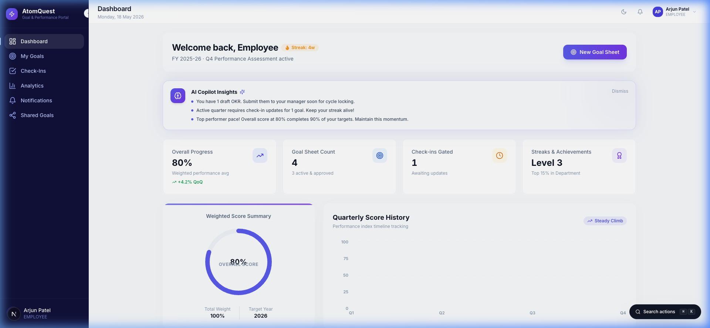
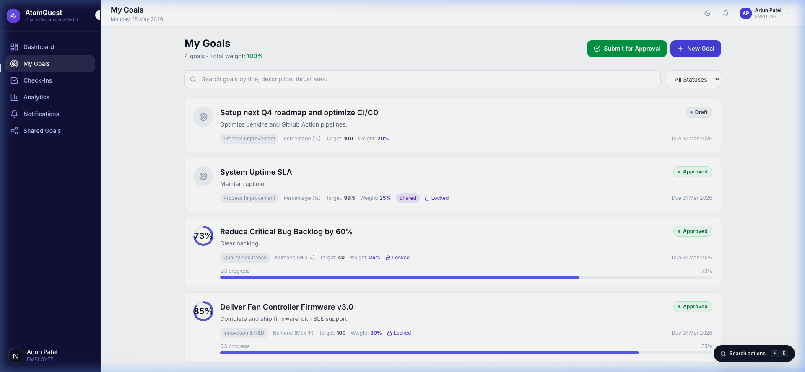
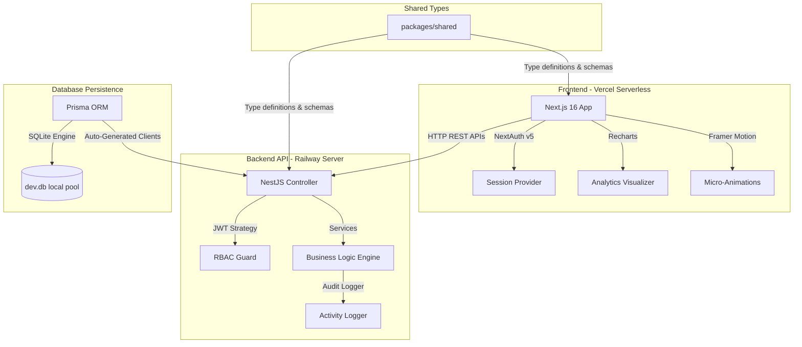

# ⚡ AtomQuest: Enterprise Goal & Performance Portal

AtomQuest is a state-of-the-art, enterprise-grade OKR (Objectives and Key Results) and Performance Management Portal designed for **Atomberg Technologies**. It is built as a high-performance Turborepo monorepo workspace to align team metrics, track progress, facilitate collaborative manager reviews, and visualize company performance.

### 🔗 Live Production Access
* **Live Web App (Vercel)**: [https://atomberg-igb3wciih-keshav2101s-projects.vercel.app](https://atomberg-igb3wciih-keshav2101s-projects.vercel.app)
* **API Documentation (Railway)**: `http://localhost:4000/api/v1` (Backend service)
* **GitHub Repository**: [https://github.com/keshav2101/atomquest-portal](https://github.com/keshav2101/atomquest-portal)

---

## 📸 Styled UI Showcase

The portal utilizes a custom-built, modern slate-indigo theme featuring premium glassmorphism layout containers, smooth Framer Motion scaling, responsive Recharts score histories, and neon-glow status cards:

### 1. Sleek Employee Performance Dashboard
An advanced interactive interface containing dynamic progress rings, streak tracking, active check-in counters, and smart **AI Copilot Insights** cards:


### 2. Beautiful OKR Goal & Metrics Listing
Filterable goal cards displaying color-coded statuses ("Approved", "Draft"), weights, metric targets, and linear check-in sliders:


---

## 🏛️ Project System Architecture

AtomQuest is architected as a high-velocity **Turborepo** + **pnpm** monorepo workspace consisting of three primary layers:



---

## ⚙️ Core Application Modules (Each & Every Part)

### 🔑 1. Authentication & Security Layer
* **Standard Credentials Provider**: Secure logins utilizing `bcrypt` password encryption.
* **NestJS JWT Validation Strategy**: Stateful sessions parsed via JSON Web Tokens on the backend using standard `JwtStrategy`.
* **Cookie-Flushed Navigation**: Improved client-to-server redirection flushes session cookies to the browser disk, preventing NextAuth session race conditions.
* **Role-Based Guards (RBAC)**: Strict endpoints protections enforcing access hierarchies (`ADMIN`, `MANAGER`, `EMPLOYEE`).

### 📊 2. Dashboard Modules
* **Employee View**: Custom weighted OKR totals, animated percentage rings, active streaks counters, and contextual notifications.
* **Manager View**: Direct reports lists, delayed submissions detectors, pending check-ins approval queue, and team performance heatmaps.
* **Admin View**: Org-wide statistics, active escalations monitors, dynamic department comparison heatmaps, and server-side activity logging viewers.

### 🎯 3. Goals & OKR Management
* **Flexible Unit of Measure (UoM)**: Support for percentage targets (`PERCENTAGE`), positive numeric targets (`NUMERIC_MAX`), or low-value targets (`NUMERIC_MIN`).
* **Weightage Distribution Guard**: Real-time sum indicators and active warnings verifying that active goal weights total exactly **100%** before submission.
* **Shared OKR Pools**: Share parent organizational objectives across department heads to enforce team alignment.
* **Concurrency Locking**: Automate status locks upon goals approval to prevent unauthorized modifications.

### 📝 4. Auditing & Change Logging
* **State Change Interceptors**: Automated recording logs triggered upon goal updates, check-ins, or status transitions.
* **Audit Database Tables**: Relational database logging tracking timestamps, changed parameters, and editor identities.

---

## 🛠️ Key Technical Fixes Implemented

### 1. Paginated Endpoint API Crashing (NestJS & Prisma Type Coercion)
* **Issue**: The API endpoints `/goals`, `/users`, and `/audit` threw a `PrismaClientValidationError` (resulting in a 500 error) because URL search strings (e.g., `page=1&limit=20`) were passed directly as string types into Prisma's `skip` and `take` fields, which strictly require `Int` values.
* **Fix**: Implemented robust type coercion using `parseInt(..., 10)` in `GoalsService`, `UsersService`, and `AuditService` to transform values into numbers.

### 2. Login Redirect Race Condition Eliminated
* **Issue**: Client-side Next.js route transitions (`router.push`) evaluated server layouts (`/dashboard/layout.tsx` running `auth()`) before the browser finished writing the session cookie, causing an immediate visual bounce back to the `/login` screen.
* **Fix**: Upgraded navigation to a window-level reload (`window.location.href = '/dashboard'`), ensuring the browser flushes all cookie assets before server component valuation.

### 3. Enabled Tailwind Compile-Time Build Pipeline
* **Issue**: Uncompiled directives in `globals.css` rendered pages without Tailwind layouts.
* **Fix**: Created the PostCSS build configuration, added `tailwindcss-animate`, and mapped design tokens (like `border-border`, `bg-background`, and font families) inside `tailwind.config.ts`.

---

## 💻 Local Installation & Setup

Ensure you have [Node.js v18+](https://nodejs.org/) installed.

### 1. Install Workspace Dependencies
Execute the monorepo package installation using `npx` (if pnpm is not in your global system path):
```bash
npx pnpm install
```

### 2. Database Sync & Seeding
Generate the local Prisma Client, execute migrations, and seed mock users:
```bash
# Generate types
npx pnpm db:generate

# Sync schema migrations
npx pnpm db:migrate

# Seed employee, manager, and admin profiles
npx pnpm db:seed
```

### 3. Start Hot-Reload Dev Servers
Launch both NestJS REST server and Next.js frontend concurrently:
```bash
npx pnpm dev
```
* Deployed Frontend: [http://localhost:3000](http://localhost:3000)
* REST API Gateway: [http://localhost:4000/api/v1](http://localhost:4000/api/v1)

---

## 👥 Seeded Demo Login Credentials

The database contains pre-configured profiles for testing out workflows:

| Role | Email | Password | Assigned Identity |
| :--- | :--- | :--- | :--- |
| **Admin / HR** | `admin@atomberg.com` | `Admin@123` | HR System Administrator |
| **Manager 1** | `manager1@atomberg.com` | `Manager@123` | Rohan Mehta (Team Lead) |
| **Employee 1** | `emp1@atomberg.com` | `Employee@123` | Arjun Patel (Software Engineer) |
| **Employee 2** | `emp2@atomberg.com` | `Employee@123` | Sneha Reddy (QA Specialist) |

---

*Developed for the AtomQuest Hackathon 1.0 · Atomberg Technologies*
