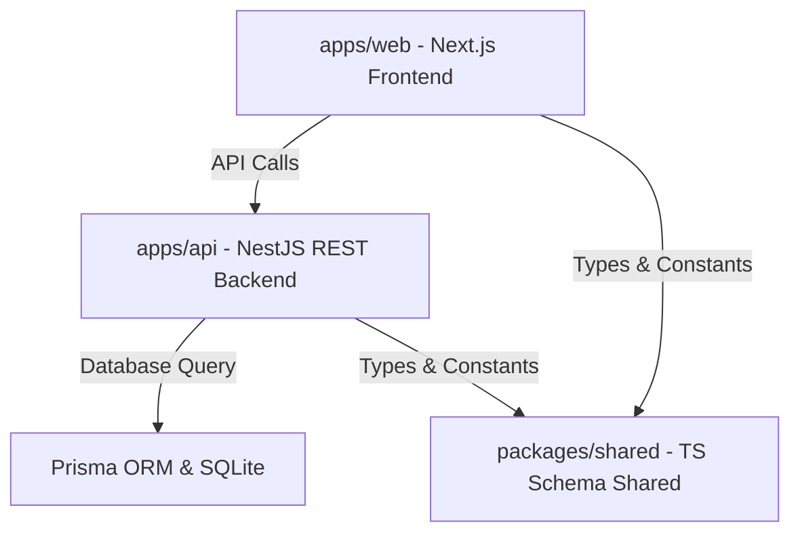

# ⚡ AtomQuest: Enterprise Goal & Performance Portal

AtomQuest is a premium, enterprise-grade OKR (Objectives and Key Results) and Performance Management Portal designed for **Atomberg Technologies**. Built as a high-performance monorepo, it enables seamless alignment, real-time tracking, collaborative approvals, and key metrics visualization across departments.

---

## 🚀 Key Features

- **Personal OKR Dashboards**: Custom metrics views for Employees, Managers, and Admins displaying progress tracking, strengths, streaks, and AI Copilot insights.
- **Interactive Goal Management**: Structured goal cards supporting weighted goals, multi-unit targets (percentages, numeric milestones), shared team goals, and status locks.
- **Collaborative Approval Workflows**: Direct check-in submissions and manager-gated review tools with automated timeline warnings.
- **Real-Time Analytics Heatmaps**: Department-wise completion heatmaps, quarterly trend trackers, and top team performer visualizations.
- **Enterprise-Grade RBAC**: Strict Role-Based Access Control and authentication securing sensitive employee records.

---

## 🛠️ Monorepo Technology Stack

AtomQuest is structured as a **Turborepo** + **pnpm** monorepo workspace containing three primary packages:



### 1. Web Frontend (`apps/web`)
- **Framework**: [Next.js 16 (App Router)](https://nextjs.org/) for optimized server-side rendering and client transitions.
- **Styling**: [Tailwind CSS v3](https://tailwindcss.com/) with a custom dark-indigo glassmorphism theme, customized scrollbars, and modern font mapping.
- **Animations**: [Framer Motion](https://www.framer.com/motion/) for fluid transitions, micro-animations, and card hover scaling.
- **Session & Auth**: [NextAuth.js v5 (Beta)](https://authjs.dev/) managing secure credentials-based auth.
- **Charts**: [Recharts](https://recharts.org/) for beautiful, responsive line graphs and concentric goal rings.

### 2. API Backend (`apps/api`)
- **Framework**: [NestJS](https://nestjs.com/) powering a modular, standard dependency-injection REST API.
- **Database Access**: [Prisma ORM](https://www.prisma.io/) providing automated typescript definitions and database migrations.
- **Database Engine**: [SQLite](https://www.sqlite.org/) (configured via local file `dev.db` for rapid developer boot).

### 3. Shared Library (`packages/shared`)
- Shareable typescript schemas, constant mappings, and formatting helpers utilized uniformly across frontend and backend packages.

---

## 🔧 Recent Critical Enhancements & Bug Fixes

We recently resolved two critical blockers and optimized the design system's compiler:

### 1. Database-Level 500 REST API Crash Resolved
- **Problem**: When querying paginated endpoints (such as goals, users, or audit logs), NestJS controllers extracted query parameters (`page`, `limit`) directly from raw URL queries as strings (e.g., `"20"`). Passing these directly into Prisma's `take` and `skip` commands resulted in a `PrismaClientValidationError` because Prisma strictly expects integer types.
- **Fix**: Implemented explicit integer coercion (`parseInt(..., 10)`) within the `GoalsService`, `UsersService`, and `AuditService` before passing values to the Prisma ORM.

### 2. Auth Session Cookie Race Condition Solved
- **Problem**: Using `router.push('/dashboard')` immediately after client credentials authentication caused Next.js to evaluate the dashboard layout's server-side session checks (`auth()`) before the browser finished writing the session cookies. This triggered an immediate, unexpected redirect straight back to `/login`.
- **Fix**: Replaced client-side transitions with a window-level reload (`window.location.href = '/dashboard'`), ensuring the browser flushes and commits the session cookie to the disk, guaranteeing redirection stability.

### 3. Enabled Tailwind Compile-Time Build Pipeline
- **Problem**: The frontend had uncompiled Tailwind directives resulting in raw unstyled text.
- **Fix**: Added a standard `postcss.config.js` compiler configuration, installed `tailwindcss-animate`, and fully mapped custom design system tokens (such as `border-border` and extended base variables) inside `tailwind.config.ts`. The portal now displays a gorgeous dark slate interface!

---

## 📋 Credentials & Quick-Select Demo Accounts

The database comes pre-seeded with realistic employee and manager profiles. The login screen features convenient quick-select cards:

| Role | Email | Password | Representative |
| :--- | :--- | :--- | :--- |
| **Admin / HR** | `admin@atomberg.com` | `Admin@123` | HR Administrator |
| **Manager 1** | `manager1@atomberg.com` | `Manager@123` | Rohan Mehta |
| **Employee 1** | `emp1@atomberg.com` | `Employee@123` | Arjun Patel |
| **Employee 2** | `emp2@atomberg.com` | `Employee@123` | Sneha Reddy |

---

## 💻 Local Installation & Setup

Ensure you have [Node.js v18+](https://nodejs.org/) installed on your machine.

### 1. Install Dependencies
Run the command via pnpm (using `npx` if pnpm is not in your global system PATH):
```bash
npx pnpm install
```

### 2. Initialize Database & Seed
Prepare the Prisma ORM schemas, run database migrations, and seed demo accounts:
```bash
# Generate Prisma Client types
npx pnpm db:generate

# Apply migrations
npx pnpm db:migrate

# Seed demo users & metrics
npx pnpm db:seed
```

### 3. Run Development Servers
Start both backend API server and Next.js frontend dev server simultaneously in hot-reload mode:
```bash
npx pnpm dev
```
- Frontend app: [http://localhost:3000](http://localhost:3000)
- Backend API docs: [http://localhost:4000/api/v1](http://localhost:4000/api/v1)

---

## 🌐 Production Deployment

The codebase is configured for GitOps deployment workflows:
- **Frontend (Vercel)**: Deploys using standard Next.js edge build paths specified in `vercel.json`.
- **Backend (Railway / Render)**: Leverages Nixpacks builds and custom service configs inside `railway.toml`.

---

*Developed for the AtomQuest Hackathon 1.0 · Atomberg Technologies*
